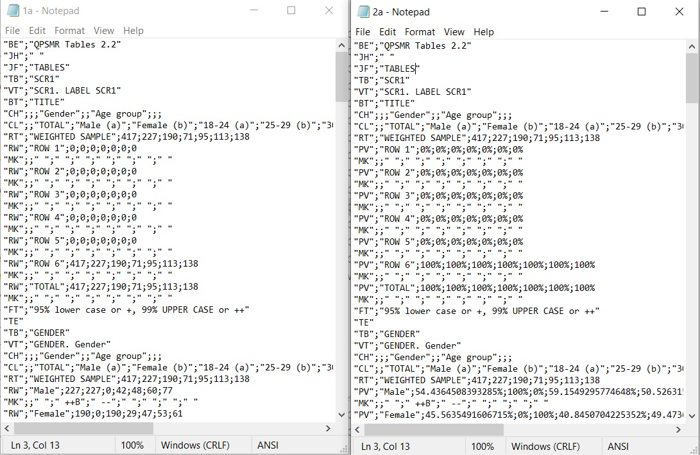

# FormatTablesp3

This applications takes as input the output file(s) of QPSMR tabulation software, in csv format, and creates a single excel file with the combined contents of the input file(s).

The input file(s) may be a single csv file (counts only, percentages only or counts and percentages together) or two files (one for counts and one for percentages)

The excel file that is created has seperate table sheets for

- counts,
- percentages,
- the statistical important differences, if present in the input file(s) and
- table of contents

The table of contents has hyperlinks to navigate to each table on each of the above sheets

The counts, percentages and statistics sheets contain

- hyperlinks back to table of contents,
- hyperlinks to corresponding tables on the other sheets,
- hyperlinks to the next and previous tables on the same sheet and
- The cells with statistical important differences are colored accordingly and have hyperlinks to the corresponding cells of the stats sheet

## Gui

## Input files

#### Separate files (one for counts and one for percentages)

#### Single file with both counts and percentages

## Output

#### Table of Contents

#### Counts sheet

#### Stats sheet

